## 내 Jejkyll 블로그의 레이아웃 변천사

- 초창기

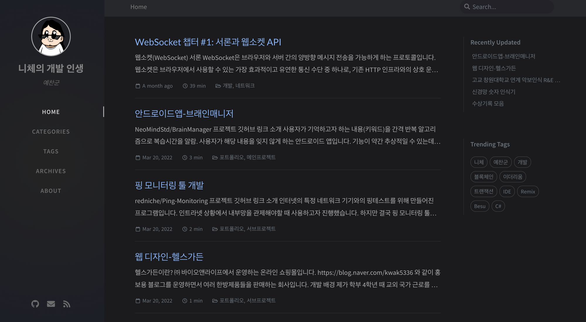

- 과도기

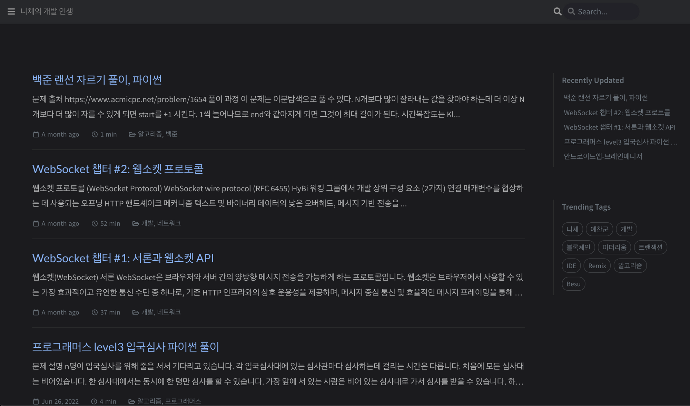

- 그리고 현재..(현재 사이트 참고)

## 왜 이런 변화가 있었을까?

1. 우선 기존 블로그에선 글을 읽기가 불편했다.
   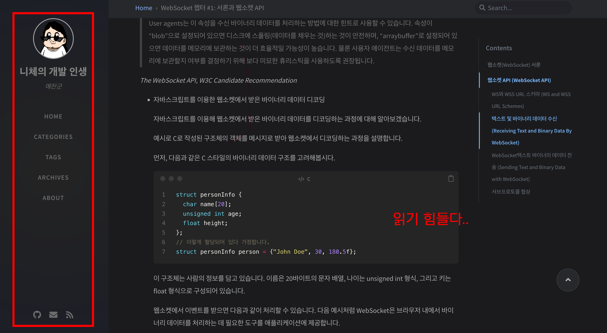

- 왼쪽의 메뉴가 공간을 너무 차지한다.

2. 네비게이션에 카테고리가 없다.
   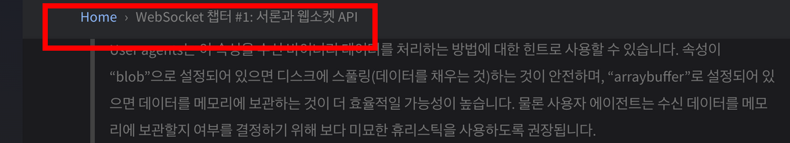

- 포스트에 카테고리는 분명 있는데...

3. 메인메뉴에서 이미지 썸네일이 없어서 딱딱해 보인다.
   

그래서 바꾼 레이아웃이 바로 이거다!

## 과도기 레이아웃

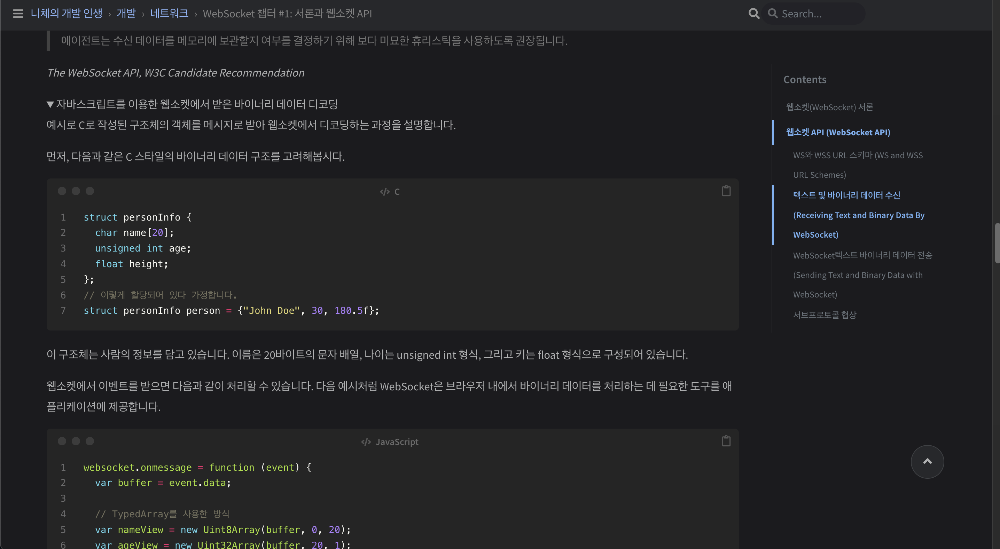

- 이제 사이트의 공간이 늘어났고 카테고리 네비게이션도 직관적이다.

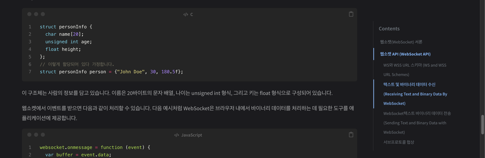

- 또 스크롤을 조금 내리면 이렇게 네비게이션 topbar가 숨겨지기까지 한다.
- 또 당시 지킬 테마 버전에선 모바일 디바이스에서 화면 back-to-top 스크롤 버튼이 보이지 않는 문제가 있었는데 겸사겸사 이것도 화면 사이즈에 맞춰 적당한 버튼이 나타나도록 변경했었다.

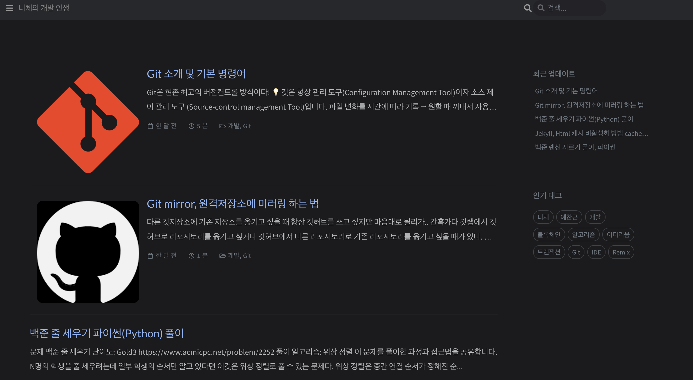

- 메인 메뉴에 이렇게 기존에 있던 라이브러리의 이미지 지연 로딩을 추가해서 게시글의 썸네일을 보여줬다.

## 문제 발생

> 그리고 여기서 문제를 느낀다.  
> 사람들이 콘텐츠에 집중하는 것은 좋다. 하지만 셀프 프레젠테이션은?  
> 그리고 지킬 버전과 내부에서 동작하는 플러그인들이 업데이트 되면서 크고 작은 문제를 발생시키기 시작한다.

1. 아무런 변경사항이 없어도 에러가 발생하기 시작한다.

   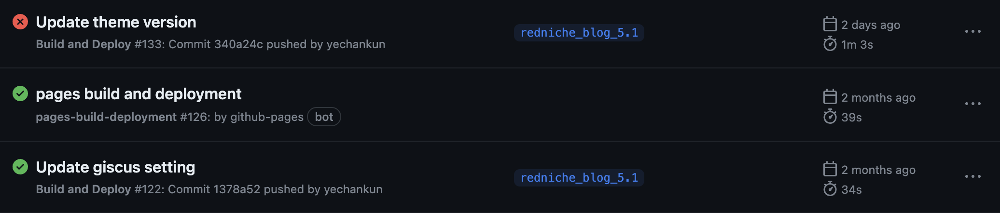

- 이 이미지는 참고용으로 아무 변경사항이 없는 것은 아니다.
- 하지만 실제로 아무 변경사항이 없어도 위와 같이 github action 파이프라인이 에러를 뿜기 시작했다.
- ... 왜냐하면 jekyll에서 사용하는 gem의 플러그인들이 고정 버전이 아니라서 버전이 업데이트 될수록 크고 작은 문제들이 생기는 것이다.

2. 테마 원본에도 없던 기능들이 마구 추가되었다.
   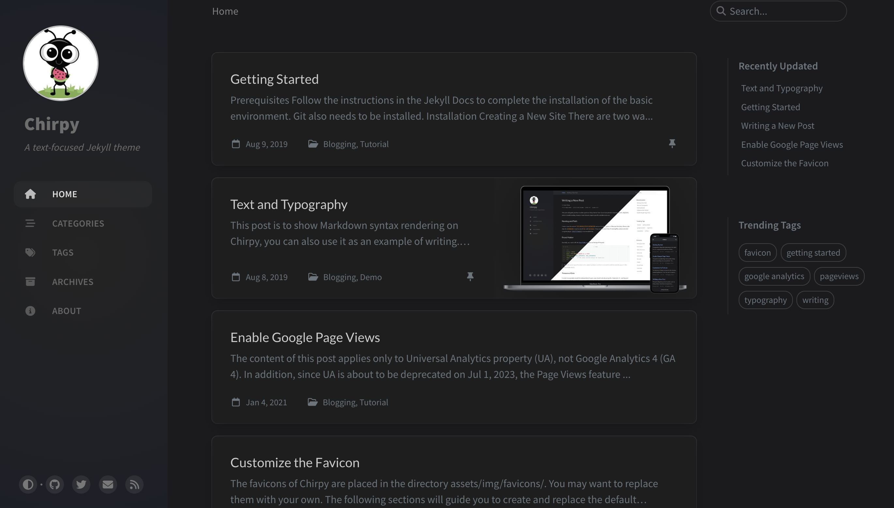

- 우선 카테고리에 아이콘들이 생겨 깔끔하고 외국인 접근성은 늘려줬다.
- 다크모드, 라이트모드를 동적으로 변경할 수 있게 되었다.
- 메인 메뉴에 이미지 썸네일도 생겨났다.
  - _이렇게 생길줄 알았으면 기여나 해볼걸.._
- javascript와 css, scss 구조가 개선되었다.

그래서 결정했다.

## Jekyll Theme 원본 Merge

- 무슨 거창한 것마냥 말해놨는데 사실 내 블로그는 굉장히 일반적이지 않은 구조라 결정이 힘든 구조였다.

### 일반적이지 않은 이유

- 우선 내 깃허브 블로그는 가장 초기에 starter를 Fork하는 것에서부터 시작했다.
- 이는 자바스크립트, css 등 수정 없이 테마를 그대로 쓰고 싶을 때 사용하는 것이다.

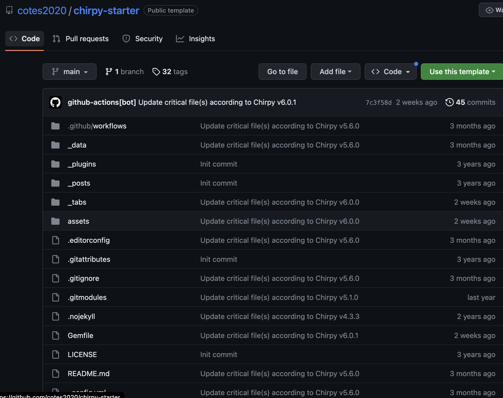

- 테마까지 수정하려면 애초에 [GitHub - cotes2020/jekyll-theme-chirpy](https://github.com/cotes2020/jekyll-theme-chirpy) 라는 저장소를 Fork 해야 했다.
- 하지만 나는 귀찮은 것 딱 질색인 한국인 중 한 명이었다...
- 당시 나는 가진 포스트를 새로 포크한 리포지토리에 다시 복사 붙여넣기해서 다시 커밋 하는 비효율적인 작업을 참을 수 없었다.
  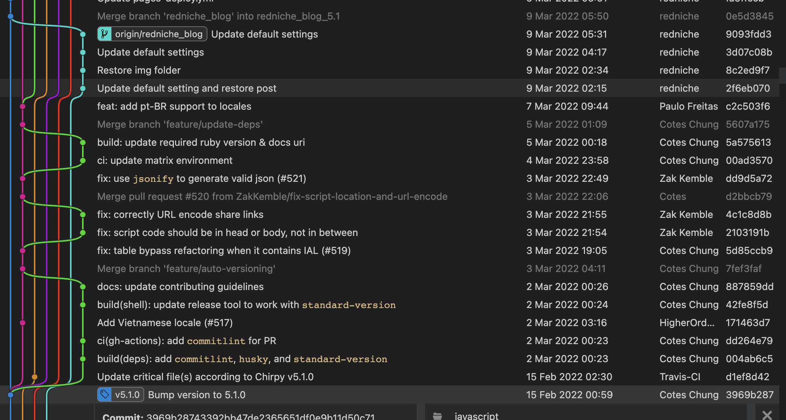
- 그 귀차니즘의 결과로 나는 원격 저장소를 전체 테마 코드베이스 저장소에 재연결 해서 그 동안 썼던 포스트를 Merge시키는 마개조를 성공하게 된다..

그 후 테마의 모든 코드를 뜯고 맛볼 수 있게 되자 css부터 javascript까지 수 많은 수정작업을 거쳤다.

따라서 [Jekyll Theme 원본 Merge](#jekyll-theme-원본-merge)란 결정은 굉장히 버거운 문제였다.

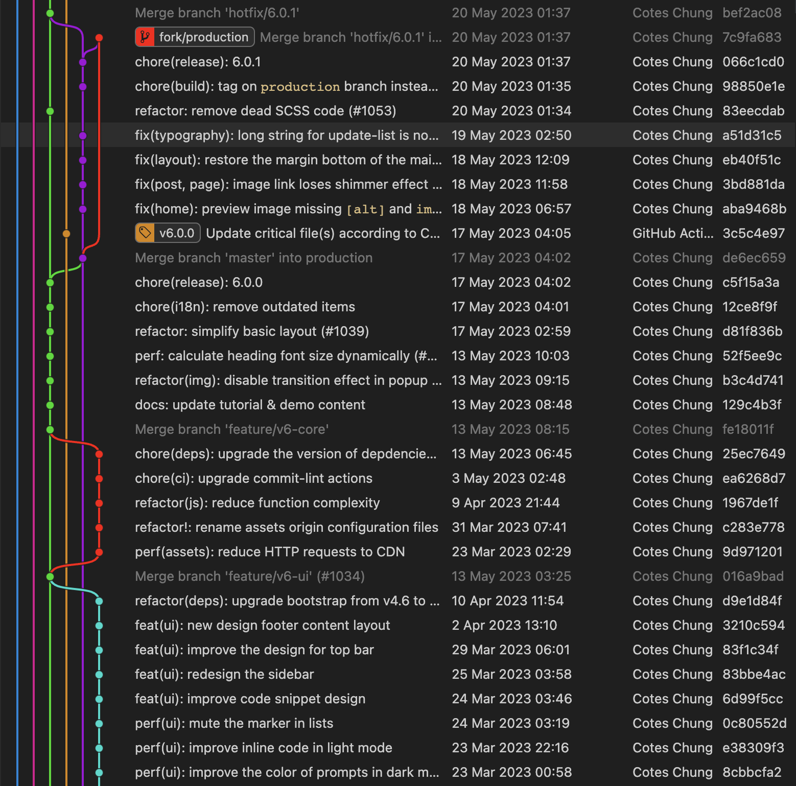

마지막 merge로부터 약 1년 반.. Jekyll Theme 원본엔 수많은 변화가 있었고 내 블로그의 수정사항도 많았다..

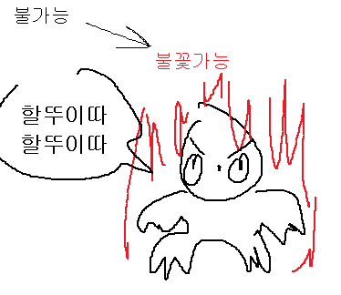

## 하지만 나는 의지의 한국인

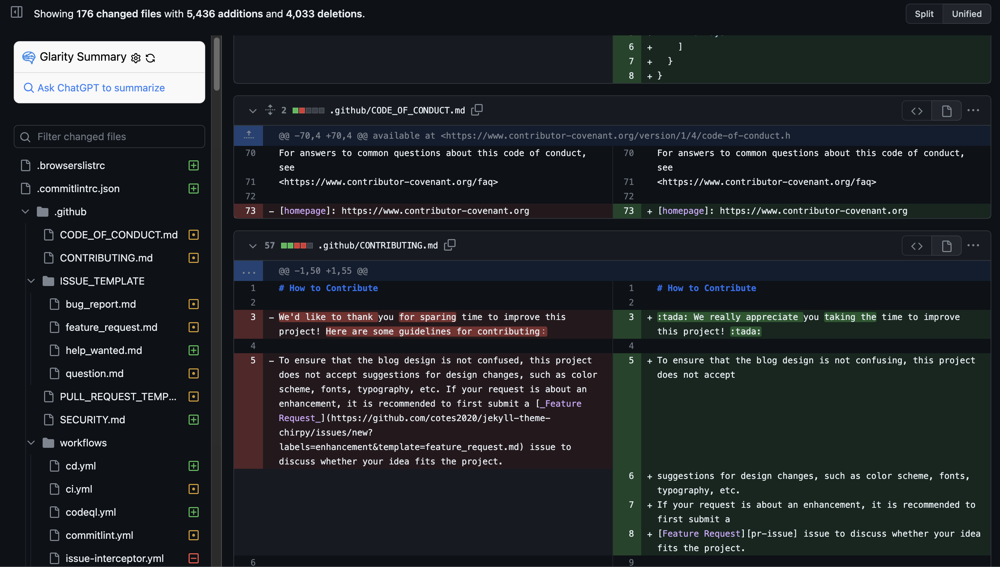

- 스쿼시 머지를 통해 모든 충돌사항을 해결하고 머지를 성공했다.
- 스쿼시 머지를 쓴 이유는 내 브랜치의 라인은 한 줄로 계속 이어가고 싶고 또 이런 많은 변경사항을 스쿼시 머지 하는 것도 잘 동작할지 궁금해서이다.
- 머지 한 번으로 해결되지는 않았지만 두 차례 머지를 하고 문제를 몇 번 더 해결하니 모든 문제가 해결되었다.
- 그렇게 완성한 것이 지금 페이지다.

## 하지만 남은 것들..

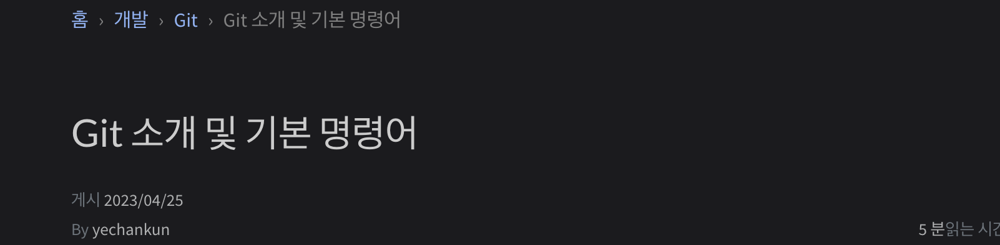

- 모든 것이 좋으면 좋겠지만 이제 동적으로 숨겨졌다 생겼다 하는 topbar가 사라져버렸다.
- 훨씬 직관적이고 좋았던 레이아웃이었는데 다시 작업을 추가해 봐야겠다.
- 그리고 원본 테마에 카테고리로 네비게이션을 해놓는 작업을 이슈를 만들어서 풀리퀘스트 요청 해볼 생각이다.

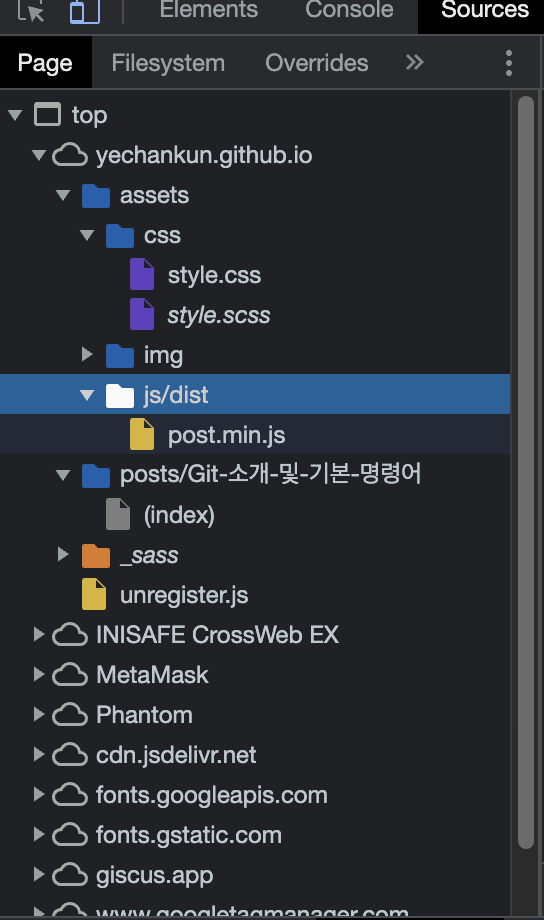

- 또 다른 이슈는 내가 작업했던 캐시 버스팅이 사라진 것이다.
- 머지할 때는 잊고 있었는데 원본 테마에는 캐시 버스팅이 있지 않아 캐시가 있는 경우 레이아웃 업데이트가 캐시 비우기(강력 새로고침)를 통해서만 가능하다.

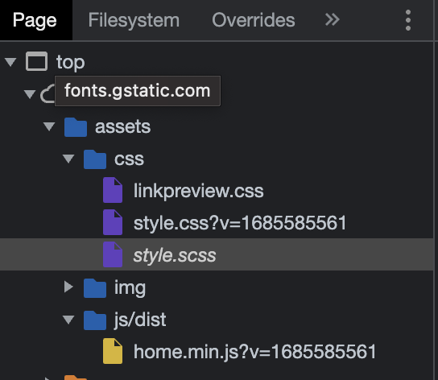

- 이처럼 파일명에 버전 태그를 지정해서 캐시를 쓰지 않고 수정한 css와 js를 다시 다운하게 만든 것이었는데 재작업이 필요해졌다.
- 이 또한 작업 후 원본 테마 저장소에 풀리퀘스트 요청 작업도 해보면 좋아보인다.
