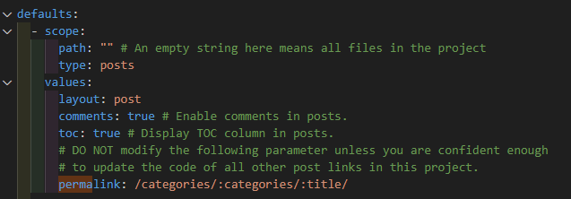

## 🧐깃허브 블로그 이미지 업로드 꿀팁

우선 깃허브에 블로그를 페이지로 게시하기 위해 루비온레일즈를 쓰는 대부분은 지킬(Jekyll)을 사용하고 있을 것 같은데요. 

이미지의 경로 때문에 골칫거리라고 생각하시는 분이 꽤 있을거에요!! 저도 그랬거든요.  


```markdown
- 예전에 이미지는 이런 방식으로 썼었어요

```


## 😢 문제는 포스트 관리가 귀찮아진다는 것입니다

그런데 이런 방식의 문제점은 블로그 포스트를 관리하기가 너무 귀찮아져요.

블로그 포스트는 경로는 이런데  
`/_posts/developer/blockchain/2022-02-22-블록체인-이더리움을 통해 맛보기-1/2022-02-22-블록체인-이더리움을 통해 맛보기-1.md`

블로그 포스트의 이미지 경로는
`/assets/img/develop/blockchain/etherium/infomation/1_1.png`  
이렇게 되어버리는거죠.

## 😍 해결법

`jekyll-postfiles`를 활용합니다!  
[https://github.com/nhoizey/jekyll-postfiles](https://github.com/nhoizey/jekyll-postfiles)

Gemfile에 다음을 추가하세요!

```ruby
source 'https://rubygems.org'

gem 'jekyll'

group :jekyll_plugins do
  gem 'jekyll-postfiles'
end
```


기본적으로 jekyll은 모든 페이지를 한 폴더에 생성해버려요.  
Jekyll은 파일명의 중복 때문에 기본적으로 jekyll에선 markdown 외 파일들을 생성한 _site 폴더에 추가하지 않아요!  

하지만 이 플러그인은 게시글 폴더의 모든 파일을 HTML페이지가 생성될 폴더에 복사해요!  

permalink의 설정에 맞춰 폴더를 생성해서 파일의 중복을 막는거죠 😘

지킬 테마를 그대로 사용한다면 `[계정명].github.io/posts/[제목]` 과 같이 블로그 포스트의 링크가 정해져요.  
`_config.yml`에서 `/posts/:title/`라는 permalink 설정을 사용하기 때문인데요.

저는 이걸 좀 바꾸어서 `/categories/:categories/:title/` 라는 설정을 사용합니다. 

제 포스트의 링크를 보면 좀 더 깔끔한거 같지 않나요!!?(모름)

  

그렇게 되면 

```
categories/
  /...
  카테고리들
  .../
    글제목/
        index.html
        ...기타 파일들
```
이 플러그인은 이런 결과물을 생성해요.  
그리고 이제 이미지를  
```markdown
  
```
과 같은 방식으로 쉽게 게시글에 등록할 수 있어요!

## 😊 이제부턴 쉽게 깃허브 블로그에 이미지를 올려보세요!

### 추가 추천사항

이미지를 더욱 쉽게 블로그에 올리고 관리하고 싶다면 

이름: Paste Image  
ID: mushan.vscode-paste-image  
설명: paste image from clipboard directly  
버전: 1.0.4  
게시자: mushan  
VS Marketplace 링크: [https://marketplace.visualstudio.com/items?itemName=mushan.vscode-paste-image](https://marketplace.visualstudio.com/items?itemName=mushan.vscode-paste-image)

를 추천합니다!


컨트롤 CV만으로 마크다운에 쉽게 이미지를 추가할 수 있어요.