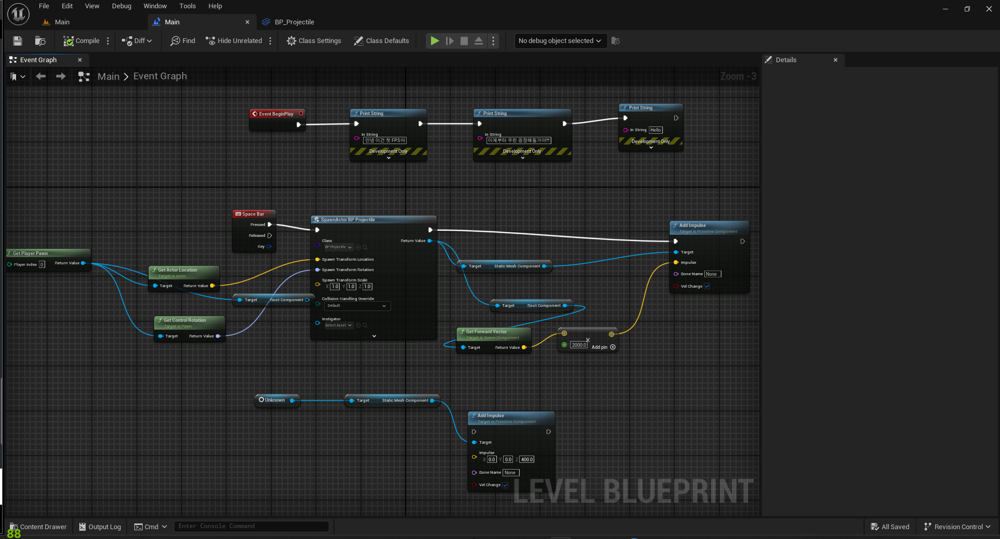

## 언리얼 공부 시작!

Udemy에서 언리얼 엔진 및 기타 여러 관심있는 강의들을 구매했어요!

취미로 게임 개발을 하고 싶어서요 ㅎㅎ

재밌는 게임 기획을 짰는데 만들 기량이 지금은 없어서 사게 됐네요 ㅋㅋ

겨우 이제야 하나의 강의를 10%만 봤어요. 2개월 안에 어느정도 다 보고 싶네요

## 2일차 결과

배운걸 정리하자면 이래요!
- 레벨 기초 구성, 뷰포트 조작
- 지오메트리 브러시
- 액터 배치
- 액터를 블루프린트 서브 클래스로 변환
- 블루프린트로 액터 생성 및 임펄스 주기
- 블루프린트의 다양한 노드 작업
- 액터에 머터리얼 단순 적용
- 물리 계산 적용
- 여러 물체를 한꺼번에 복사하거나 다른 액터로 재배치

## 만든 블루프린트 작업물

갈 길이 아직 머나멉니다!